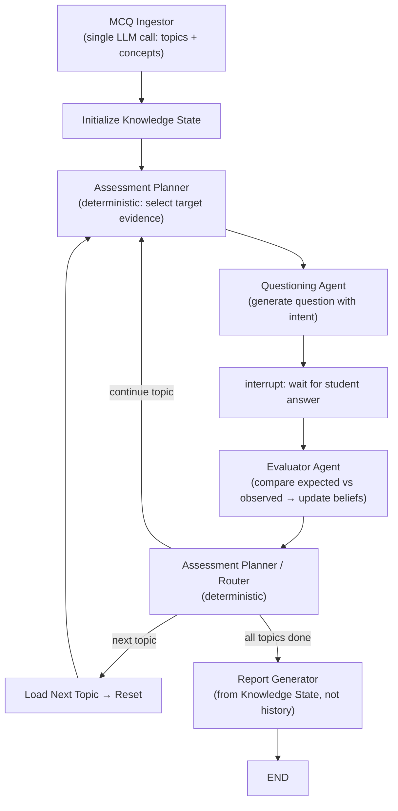
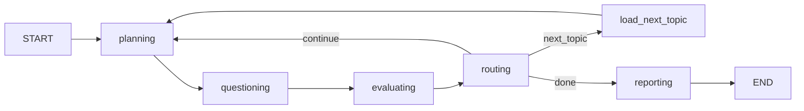
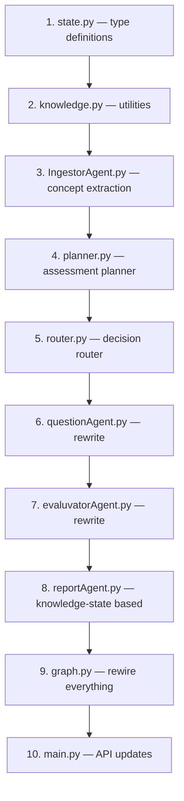

# Evidence-Driven Knowledge-Model Architecture — v2

Redesign the MCQ Evaluator into a **scientific assessment system**: `Hypothesis → Question → Answer → Evidence → Belief Update`.

## Architecture



The **Knowledge State** is the center. Every agent reads from and writes to it.

The **Assessment Planner** is deterministic logic (no LLM). It selects the target evidence, the Questioning Agent merely transforms that into a natural question.

---

## Changes from v1 (User Feedback)

| # | Change | Detail |
|---|--------|--------|
| 1 | Safety limit | 10, not 8. Fail-safe only. |
| 2 | Ingestor | Single LLM call for topics + concepts + grouping |
| 3 | Multi-topic | Router maintains `current_topic_index`, frontend unaware |
| 4 | Qualitative states | `UNKNOWN → EMERGING → PARTIAL → STRONG → MASTERED` (agents reason in states, not floats) |
| 5 | Extended ConceptState | Added `last_updated_turn`, `information_gain`, `evidence[]` |
| 6 | Belief model | Concept → Evidence → Belief (not Concept → Status) |
| 7 | Question Intent | `{target_concept, hypothesis, expected_evidence}` on every question |
| 8 | Question styles | Replaced Prediction with Design, added Counterexample |
| 9 | Info gain reason | Evaluator explains WHY, not just labels |
| 10 | Structured info gain | `{new_concepts, updated_concepts, misconceptions_found, information_gain, reason}` |
| 11 | Uncertainty in Router | Concepts with confidence ~0.5 trigger more questions |
| 12 | Report from KS | Knowledge State is truth, history provides quotes |
| 13 | Assessment Planner | Deterministic logic selecting target evidence |
| 14 | Scientific loop | Hypothesis → Question → Answer → Evidence → Belief Update |
| 15 | Expected vs Observed | Evaluator literally compares intent.expected_evidence vs actual answer |

---

## Proposed Changes

### 1. Graph State — The Evidence-Based Knowledge Model

#### [MODIFY] [state.py](file:///Users/sashanth/Documents/McqEvaluvator/backend/app/state.py)

Currently empty. Will define the full state with the evidence-based belief model:

```python
class EvidenceEntry(TypedDict, total=False):
    question_style: str      # "explanation" | "comparison" | "application" | ...
    observation: str          # "Understands residual capacity but confuses reverse edges."
    turn: int                 # which question number produced this

class ConceptBelief(TypedDict, total=False):
    belief: str               # "unknown" | "emerging" | "partial" | "strong" | "mastered" | "misconception"
    confidence: float         # 0.0 - 1.0 (internal use; agents reason via belief labels)
    evidence_count: int
    evidence: List[EvidenceEntry]
    question_styles_used: List[str]
    misconceptions: List[str]
    last_updated_turn: int
    information_gain: str     # "high" | "medium" | "low" (from last update)

class KnowledgeState(TypedDict, total=False):
    concepts: Dict[str, ConceptBelief]

class QuestionIntent(TypedDict, total=False):
    target_concept: str
    hypothesis: str           # "Student may understand residual capacity but not reverse edges."
    expected_evidence: str    # "If they explain reverse edge creation correctly, confidence increases."

class InformationGainReport(TypedDict, total=False):
    new_concepts: int
    updated_concepts: int
    misconceptions_found: int
    information_gain: str     # "high" | "medium" | "low"
    reason: str               # WHY this gain level

class TopicData(TypedDict, total=False):
    topic: str
    concepts: List[str]
    related_mcqs: List[Dict[str, Any]]
    no_of_questions: int
    no_of_crt_ans: int

class InterviewState(TypedDict):
    thread_id: str

    # Multi-topic support
    all_topics: List[TopicData]
    current_topic_index: int

    # Current topic working state
    current_topic: str
    concept_map: List[str]
    related_mcqs: List[Dict[str, Any]]

    # Interview loop
    interview_history: Annotated[List[Dict[str, Any]], operator.add]
    current_question: Dict[str, Any]
    current_intent: QuestionIntent
    student_answer: str
    current_evaluation: Dict[str, Any]

    # Knowledge model (THE CENTER)
    knowledge_state: KnowledgeState
    question_count: int
    information_gain_history: Annotated[List[Dict[str, Any]], operator.add]

    # Planner output (passed to Questioning Agent)
    planner_directive: Dict[str, Any]

    # Termination
    stop_reason: str
    report: str
```

---

### 2. Ingestor — Single LLM Call for Topics + Concepts

#### [MODIFY] [IngestorAgent.py](file:///Users/sashanth/Documents/McqEvaluvator/backend/app/agents/IngestorAgent.py)

**Key change:** Merge topic classification and concept extraction into a **single LLM call**.

The system prompt is extended so the LLM returns:

```json
{
  "topics": [
    {
      "question_index": 0,
      "topic": "Breadth-First Search",
      "concepts": ["Shortest Path Property", "Queue Usage", "Level-Order Traversal"]
    }
  ]
}
```

**Changes to `classify_topics_batch()`:**
- Update system prompt to also extract concepts per question
- Update output format to include `concepts` array
- Update `validate_llm_response()` to accept the new schema (concepts is optional for backward compat)

**Changes to `process_csv()` grouping logic:**
- After grouping by topic, aggregate all concepts from questions in that topic
- Deduplicate concepts per topic
- Each topic entry in the output becomes:
  ```json
  {
    "topic": "Breadth-First Search",
    "no_of_questions": 3,
    "no_of_crt_ans": 2,
    "concepts": ["Shortest Path Property", "Queue Usage", "Level-Order Traversal", "Time Complexity", "BFS vs DFS"],
    "questions": [...]
  }
  ```

**Cost/latency:** Same as before (single batch call), just richer output.

---

### 3. Knowledge State Utilities

#### [NEW] [knowledge.py](file:///Users/sashanth/Documents/McqEvaluvator/backend/app/knowledge.py)

Pure deterministic utility module (no LLM calls). All functions are testable.

```python
def initialize_knowledge_state(concepts: List[str]) -> KnowledgeState
    # All concepts start as "unknown", confidence 0.05, empty evidence

def compute_concept_coverage(ks: KnowledgeState) -> float
    # Fraction of concepts with evidence_count >= 2

def compute_overall_confidence(ks: KnowledgeState) -> float
    # Mean confidence across all concepts

def get_untested_concepts(ks: KnowledgeState) -> List[str]
    # belief == "unknown"

def get_uncertain_concepts(ks: KnowledgeState) -> List[str]
    # 0.3 < confidence < 0.7 (high uncertainty zone)

def get_misconceptions(ks: KnowledgeState) -> List[str]
    # belief == "misconception" or has entries in misconceptions[]

def get_stable_misconceptions(ks: KnowledgeState) -> List[Tuple[str, List[str]]]
    # Misconceptions confirmed through >= 2 different question styles

def check_diminishing_returns(info_gain_history: List[Dict]) -> bool
    # True if last 2 entries have information_gain == "low"

def get_highest_uncertainty_concept(ks: KnowledgeState) -> Optional[str]
    # Concept with confidence closest to 0.5 (maximum uncertainty)

def merge_concept_update(ks: KnowledgeState, concept: str, update: ConceptBelief) -> KnowledgeState
    # Immutable merge of evaluator's update into the knowledge state
```

---

### 4. Assessment Planner (Deterministic Router Logic)

#### [NEW] [planner.py](file:///Users/sashanth/Documents/McqEvaluvator/backend/app/planner.py)

**Not an LLM agent.** Pure deterministic logic that answers:

1. Which concepts remain untested?
2. Which concepts have conflicting evidence?
3. Which misconceptions are stable?
4. Which concept offers the highest expected information gain?

```python
def plan_next_assessment(state: InterviewState) -> Dict[str, Any]:
    """
    Returns a planner directive for the Questioning Agent:
    {
        "target_concept": "Residual Graph",
        "reason": "High uncertainty (confidence 0.51), needs more evidence",
        "suggested_style": "counterexample",
        "styles_to_avoid": ["comparison"],  # already used for this concept
        "context": "Student previously confused reverse edges"
    }
    """
```

**Selection priority:**
1. Concepts with active misconceptions (need confirmation via different style)
2. Concepts with high uncertainty (confidence near 0.5)
3. Untested concepts
4. Concepts with only 1 evidence entry (need corroboration)
5. Low-confidence concepts

**Style selection:**
- Pick from `[explanation, comparison, application, debugging, counterexample, trade_off, scenario, design]`
- Exclude styles already used for this concept
- If all styles used, allow repeats but prefer least-recently-used

This function runs as a **graph node** between Evaluator and Questioning Agent, writing its output to `state["planner_directive"]`.

---

### 5. Decision Router (Stopping Logic)

#### [NEW] [router.py](file:///Users/sashanth/Documents/McqEvaluvator/backend/app/router.py)

Also deterministic. Runs after the Evaluator, before the Planner.

```python
def should_continue(state: InterviewState) -> str:
    """Returns 'planning' | 'next_topic' | 'reporting'"""
```

**Stop current topic when ANY is true:**

| Condition | Threshold | Configurable Via |
|-----------|-----------|------------------|
| Concept Coverage | ≥ 80% have `evidence_count >= 2` | `COVERAGE_THRESHOLD` env |
| Overall Confidence | Mean confidence ≥ 0.8 | `CONFIDENCE_THRESHOLD` env |
| Diminishing Returns | Last 2 info gains are "low" | — |
| Stable Misconception | Same misconception via ≥ 2 styles | — |
| Uncertainty Resolved | No concept with 0.3 < confidence < 0.7 | — |
| Safety Limit | `question_count >= 10` | `MAX_QUESTIONS` env (default 10) |

**On topic stop:**
- If `current_topic_index + 1 < len(all_topics)` → return `"next_topic"`
- Else → return `"reporting"`

**`load_next_topic` node:**
- Increments `current_topic_index`
- Loads `all_topics[new_index]` into `current_topic`, `concept_map`, `related_mcqs`
- Reinitializes `knowledge_state` for the new topic's concepts
- Resets `question_count`, `information_gain_history`

---

### 6. Questioning Agent Rewrite

#### [MODIFY] [questionAgent.py](file:///Users/sashanth/Documents/McqEvaluvator/backend/app/agents/questionAgent.py)

**The agent's job becomes simpler.** The Assessment Planner already selected the target. The agent transforms the directive into a natural interview question.

**New context sent to LLM:**
```python
focused_context = {
    "topic": current_topic,
    "concept_map": concept_map,
    "knowledge_state": knowledge_state,
    "interview_history": interview_history,
    "planner_directive": planner_directive  # target concept, reason, suggested style
}
```

**New output format with Question Intent:**
```json
{
  "topic": "Breadth-First Search",
  "question": "Suppose you're running BFS on a graph with weighted edges...",
  "question_type": "counterexample",
  "target_concept": "Shortest Path Property",
  "intent": {
    "target_concept": "Shortest Path Property",
    "hypothesis": "Student may believe BFS always finds shortest path regardless of edge weights.",
    "expected_evidence": "If they identify that BFS only guarantees shortest path in unweighted graphs, confidence increases."
  },
  "learning_objective": "Verify student understands BFS shortest-path invariant limitations",
  "evidence_goal": "Can the student reason about when BFS shortest-path property breaks?",
  "wait_for_student_response": true
}
```

**Question styles** (updated per feedback):
`explanation | comparison | application | debugging | counterexample | trade_off | scenario | design`

**System prompt rules:**
- **Concept Coverage Rule**: Every question targets exactly one concept from the concept map
- **Exploration Rule**: Max 2 investigations per concept unless evaluator marks critical
- **Diversity Rule**: Never same reasoning style consecutively; rotate among the 8 styles
- **Information Gain Rule**: Prefer questions distinguishing between competing hypotheses
- **Anti-Repetition Rule**: Never same concept + same style
- **Conversation Rule**: Reference previous discussion, advance to new angle
- **Intent Rule**: Every question must include a hypothesis and expected evidence
- **Planner Compliance**: Follow the `planner_directive` target and suggested style

---

### 7. Evaluator Agent Rewrite

#### [MODIFY] [evaluvatorAgent.py](file:///Users/sashanth/Documents/McqEvaluvator/backend/app/agents/evaluvatorAgent.py)

**The biggest change.** The Evaluator now does scientific evidence comparison.

**New context sent to LLM:**
```python
focused_context = {
    "topic": current_topic,
    "concept_map": concept_map,
    "knowledge_state": knowledge_state,   # current beliefs
    "current_question": current_question,
    "question_intent": current_intent,     # hypothesis + expected_evidence
    "student_answer": student_answer,
    "interview_history": interview_history
}
```

**The key instruction:** Compare `intent.expected_evidence` vs what the student actually demonstrated.

**New output format:**
```json
{
  "target_concept": "Shortest Path Property",

  "expected_vs_observed": {
    "expected": "Student identifies BFS only works for unweighted graphs",
    "observed": "Student correctly identified the limitation and mentioned Dijkstra as alternative",
    "match": "exceeded"
  },

  "updated_concept": {
    "belief": "strong",
    "confidence": 0.88,
    "evidence_count": 2,
    "evidence": [
      {
        "question_style": "counterexample",
        "observation": "Correctly identified BFS shortest-path breaks with weighted edges, suggested Dijkstra.",
        "turn": 3
      }
    ],
    "question_styles_used": ["explanation", "counterexample"],
    "misconceptions": [],
    "last_updated_turn": 3,
    "information_gain": "high"
  },

  "information_gain_report": {
    "new_concepts": 0,
    "updated_concepts": 1,
    "misconceptions_found": 0,
    "information_gain": "high",
    "reason": "Student revealed understanding of shortest-path invariant limitation that had not been previously observed."
  },

  "continue_recommendation": true,
  "feedback_summary": "..."
}
```

**Code change in `run()`:**
1. Send LLM the full context including `question_intent`
2. Parse the response
3. Call `merge_concept_update()` from `knowledge.py` to update `knowledge_state`
4. Append `information_gain_report` to `information_gain_history`
5. Return updated `knowledge_state`, `current_evaluation`, `information_gain_history`, and `interview_history` entry

---

### 8. Graph Rewiring — Multi-Topic + Planner

#### [MODIFY] [graph.py](file:///Users/sashanth/Documents/McqEvaluvator/backend/app/graph.py)

**Complete rewrite.** Remove inline `InterviewState` and `should_continue`.



```python
from app.state import InterviewState
from app.planner import AssessmentPlanner
from app.router import DecisionRouter

graph.add_node("planning", planner.run)
graph.add_node("questioning", question_agent.run)
graph.add_node("evaluating", evaluator_agent.run)
graph.add_node("routing", router.run)
graph.add_node("load_next_topic", router.load_next_topic)
graph.add_node("reporting", report_agent.run)

graph.add_edge(START, "planning")
graph.add_edge("planning", "questioning")
# interrupt_before=["evaluating"] stays — this is where we wait for student answer
graph.add_edge("questioning", "evaluating")
graph.add_edge("evaluating", "routing")
graph.add_conditional_edges("routing", router.should_continue)
graph.add_edge("load_next_topic", "planning")
graph.add_edge("reporting", END)
```

---

### 9. API Layer Updates

#### [MODIFY] [main.py](file:///Users/sashanth/Documents/McqEvaluvator/backend/main.py)

**`/upload` — no change needed** (Ingestor output now includes concepts automatically).

**`/start_interview`:**
- Read ALL topics from the document (not just `topics[0]`)
- Build `all_topics` list with each topic's `concepts`, `related_mcqs`
- Initialize `current_topic_index = 0`
- Load first topic into `current_topic`, `concept_map`, `related_mcqs`
- Initialize `knowledge_state` via `initialize_knowledge_state(concepts)`
- Set `question_count = 0`, `information_gain_history = []`, `stop_reason = ""`
- Set `planner_directive = {}`, `current_intent = {}`

**`/submit_answer`:**
- Include `knowledge_state`, `stop_reason`, `question_count` in response
- The `is_complete` flag triggers when report is generated (after all topics done)
- Frontend remains unaware of topic transitions — it just sees questions and answers

**`/admin/interviews/{thread_id}`:**
- Return final `knowledge_state` per topic alongside interactions and report

---

### 10. Report Generator — From Knowledge State

#### [MODIFY] [reportAgent.py](file:///Users/sashanth/Documents/McqEvaluvator/backend/app/agents/reportAgent.py)

**Key change:** The report is generated from the **Knowledge State**, not from history. History is only used for supporting quotes.

**New data sent to LLM:**
```python
data = {
    "thread_id": thread_id,
    "topics": [
        {
            "topic": "Breadth-First Search",
            "knowledge_state": {  # THE TRUTH
                "concepts": {
                    "Shortest Path Property": {
                        "belief": "strong",
                        "confidence": 0.88,
                        "evidence": [...]
                    },
                    ...
                }
            },
            "related_mcqs": [...],
            "interview_history": [...],  # for quotes only
            "stop_reason": "concept_coverage",
            "question_count": 4
        },
        ...  # all topics
    ]
}
```

**System prompt additions:**
- "The `knowledge_state` is your primary evidence source. Do NOT reconstruct understanding from history."
- "Use `interview_history` only to extract direct quotes that support conclusions from the knowledge_state."
- "Include a `concept_breakdown` section showing per-concept belief, confidence, and key evidence."

**New report output includes:**
```json
{
  "assessment_summary": { ... },
  "topic_analysis": [
    {
      "topic": "...",
      "concept_breakdown": [
        {
          "concept": "Shortest Path Property",
          "belief": "strong",
          "confidence": 0.88,
          "key_evidence": "..."
        }
      ],
      ...existing fields...
    }
  ],
  ...existing fields...
}
```

---

## File Summary

| File | Action | Description |
|------|--------|-------------|
| [state.py](file:///Users/sashanth/Documents/McqEvaluvator/backend/app/state.py) | MODIFY | Full InterviewState with evidence-based belief model, QuestionIntent, InformationGainReport |
| [knowledge.py](file:///Users/sashanth/Documents/McqEvaluvator/backend/app/knowledge.py) | NEW | Deterministic utilities: init, coverage, uncertainty, merge, diminishing returns |
| [planner.py](file:///Users/sashanth/Documents/McqEvaluvator/backend/app/planner.py) | NEW | Assessment Planner: deterministic target evidence selection |
| [router.py](file:///Users/sashanth/Documents/McqEvaluvator/backend/app/router.py) | NEW | Decision Router: stopping criteria + multi-topic loading |
| [IngestorAgent.py](file:///Users/sashanth/Documents/McqEvaluvator/backend/app/agents/IngestorAgent.py) | MODIFY | Single LLM call for topics + concepts |
| [questionAgent.py](file:///Users/sashanth/Documents/McqEvaluvator/backend/app/agents/questionAgent.py) | MODIFY | Evidence-driven with question intent (hypothesis + expected_evidence) |
| [evaluvatorAgent.py](file:///Users/sashanth/Documents/McqEvaluvator/backend/app/agents/evaluvatorAgent.py) | MODIFY | Expected vs observed comparison, structured info gain with reason |
| [reportAgent.py](file:///Users/sashanth/Documents/McqEvaluvator/backend/app/agents/reportAgent.py) | MODIFY | Generate from knowledge_state, history for quotes only |
| [graph.py](file:///Users/sashanth/Documents/McqEvaluvator/backend/app/graph.py) | MODIFY | Add planner + router nodes, multi-topic edges |
| [main.py](file:///Users/sashanth/Documents/McqEvaluvator/backend/main.py) | MODIFY | Multi-topic init, knowledge_state in responses |

---

## Execution Order



Dependencies flow top-down. Each step builds on the previous.

---

## Verification Plan

### Automated Tests
- `python -c "from app.knowledge import initialize_knowledge_state, compute_concept_coverage; ks = initialize_knowledge_state(['A','B','C']); assert compute_concept_coverage(ks) == 0.0; print('OK')"` — knowledge utilities
- `python -c "from app.planner import AssessmentPlanner; print('Planner OK')"` — planner imports
- `python -c "from app.router import DecisionRouter; print('Router OK')"` — router imports
- `python -c "from app.state import InterviewState; print('State OK')"` — type definitions

### Manual Verification
1. Upload a CSV → verify response includes `concepts` per topic
2. Start interview → verify first question targets a concept from the planner, includes `intent` with hypothesis
3. Answer questions and observe:
   - Strong student finishes topic in 2–3 questions
   - Struggling student gets up to 10 (safety limit rarely hit)
   - Each evaluation shows `expected_vs_observed` and `information_gain_report` with reason
4. Observe multi-topic: after Topic A finishes, Topic B starts seamlessly (frontend sees continuous Q&A)
5. Check final report: includes `concept_breakdown` per topic derived from knowledge_state
6. Admin dashboard: verify old + new schema both render
