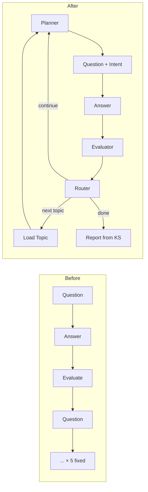

# Architecture Redesign Walkthrough

## Summary

Redesigned the MCQ Evaluator from a **question-driven loop** (fixed 5 questions, prose feedback) into an **evidence-driven, scientific assessment system** (Hypothesis → Question → Answer → Evidence → Belief Update).

## Before vs After



## Files Changed

### New Files (3)

| File | Purpose |
|------|---------|
| [state.py](file:///Users/sashanth/Documents/McqEvaluvator/backend/app/state.py) | Type definitions: `InterviewState`, `ConceptBelief`, `QuestionIntent`, `InformationGainReport`, `KnowledgeState`, `EvidenceEntry`, `TopicData` |
| [knowledge.py](file:///Users/sashanth/Documents/McqEvaluvator/backend/app/knowledge.py) | 14 deterministic utility functions for knowledge state operations |
| [planner.py](file:///Users/sashanth/Documents/McqEvaluvator/backend/app/planner.py) | Assessment Planner — 5-tier priority target selection (no LLM) |
| [router.py](file:///Users/sashanth/Documents/McqEvaluvator/backend/app/router.py) | Decision Router — 6 stopping criteria + multi-topic loading (no LLM) |

### Modified Files (6)

| File | Key Changes |
|------|-------------|
| [IngestorAgent.py](file:///Users/sashanth/Documents/McqEvaluvator/backend/app/agents/IngestorAgent.py) | Single LLM call extracts topics + concepts simultaneously |
| [questionAgent.py](file:///Users/sashanth/Documents/McqEvaluvator/backend/app/agents/questionAgent.py) | Receives planner directive; generates question with `intent` (hypothesis + expected_evidence) |
| [evaluvatorAgent.py](file:///Users/sashanth/Documents/McqEvaluvator/backend/app/agents/evaluvatorAgent.py) | Compares expected vs observed; updates knowledge_state; structured info gain with reason |
| [reportAgent.py](file:///Users/sashanth/Documents/McqEvaluvator/backend/app/agents/reportAgent.py) | Generates from knowledge_state (truth), not history; adds concept_breakdown |
| [graph.py](file:///Users/sashanth/Documents/McqEvaluvator/backend/app/graph.py) | New flow: planning → questioning → evaluating → routing → (continue/next_topic/report) |
| [main.py](file:///Users/sashanth/Documents/McqEvaluvator/backend/main.py) | Multi-topic init, knowledge_state in responses, frontend stays unaware of topic transitions |

## Key Architectural Decisions

### 1. Evidence-Based Belief Model
Each concept carries: `belief` label + `confidence` float + `evidence[]` trail + `misconceptions[]`

Agents reason in qualitative states (`unknown → emerging → partial → strong → mastered`), not raw numbers.

### 2. Question Intent (Hypothesis-Driven)
Every question includes:
```json
{
  "intent": {
    "target_concept": "Residual Graph",
    "hypothesis": "Student may understand capacity but not reverse edges",
    "expected_evidence": "If they explain reverse edges correctly, belief → strong"
  }
}
```

The Evaluator compares expected vs observed — making the assessment scientific.

### 3. Assessment Planner (Deterministic)
Not an LLM agent. Pure logic with 5-tier priority:
1. Active misconceptions
2. High uncertainty (confidence ~0.5)
3. Untested concepts
4. Needing corroboration (only 1 evidence entry)
5. Low confidence

### 4. Objective Stopping (No Fixed Count)
6 conditions, any triggers stop:
- Concept coverage ≥ 80%
- Confidence ≥ 0.8
- Diminishing returns (2 consecutive "low" info gain)
- Stable misconceptions (confirmed via 2+ styles)
- Uncertainty resolved
- Safety limit: 10 questions (fail-safe)

### 5. Multi-Topic
Router increments `current_topic_index`, reinitializes per-topic state. Frontend sees continuous Q&A.

## Verification

| Test | Result |
|------|--------|
| All imports | ✅ Pass |
| Knowledge utilities functional tests | ✅ Pass |
| Server startup (main.py) | ✅ Pass |
| End-to-end manual test | ⏳ Pending (user) |

## How to Test

1. Restart the backend server (uvicorn should auto-reload)
2. Upload a CSV via the frontend
3. Start an interview — observe the question includes an `intent` field
4. Answer questions and watch:
   - Strong answers → fewer questions
   - Weak answers → more questions, up to 10
   - Topic transitions happen silently
5. Check the report — includes `concept_breakdown` per topic
